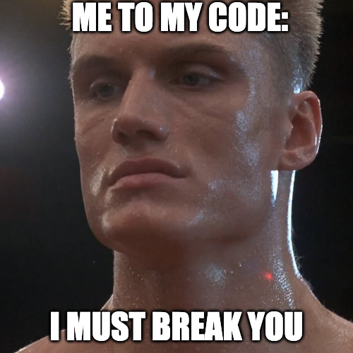

## Resources

https://www.typescriptlang.org/docs/handbook/2/generics.html#variance-annotations
https://www.typescriptlang.org/docs/handbook/interfaces.html
https://www.tutorialsteacher.com/typescript/typescript-boolean
https://www.tutorialspoint.com/typescript/typescript_boolean.htm
https://developer.mozilla.org/en-US/docs/Web/JavaScript/Reference/Global_Objects/Boolean/Boolean
https://developer.mozilla.org/en-US/docs/Web/JavaScript/Guide/Working_with_objects#defining_methods

import { useState, useEffect } from 'react';

interface FetchObject<T> {
  data: T;
  loading: boolean;
  error: Error | null;
}

const useFetch = <T>(urlString: string, RequestInit ?: object): FetchObject<T> => {

  return {data: 2 as any, loading: true, error: null};
}